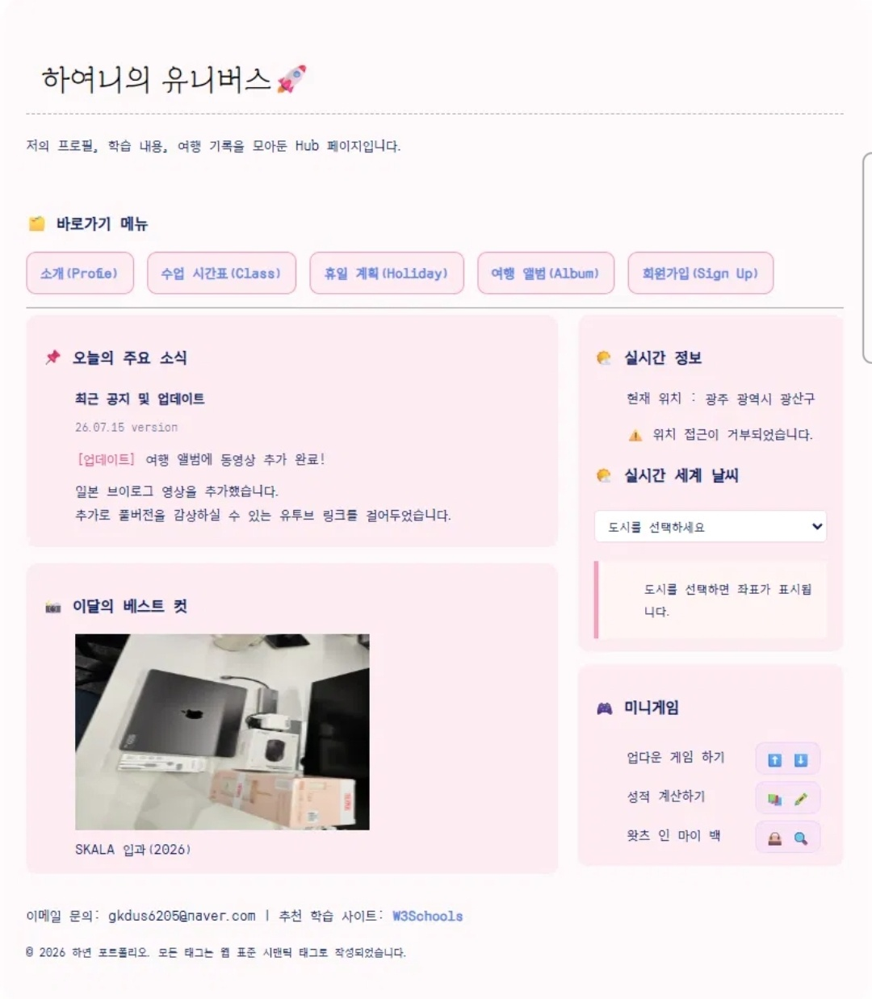
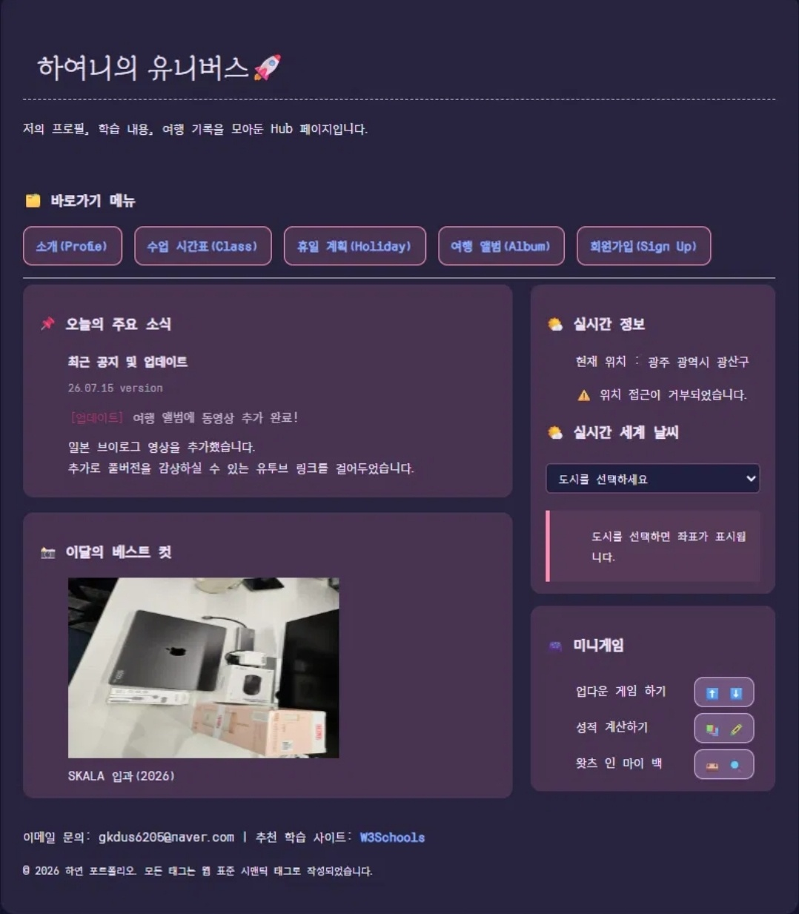

# 🚀 하여니의 유니버스

JavaScript 심화 과제 — DOM 조작, 비동기 통신, 모듈 분리를 활용한 개인 Hub 페이지
🔗 [라이브 데모 바로가기](https://gkyeon.github.io/skala-front/html/index.html)

## 📌 프로젝트 소개

내 프로필, 수업 시간표, 휴일 계획, 여행 기록, 회원가입 폼을 모아둔 개인 포트폴리오형 Hub 사이트입니다.
과제 요구사항(DOM 조작 → 비동기 호출 → 모듈 분리)을 단계별로 구현한 뒤, 실사용 가능한 수준까지 기능을 확장했습니다.

## 🖼️ 미리보기

<table>
  <tr>
    <td align="center"><br/>라이트 모드</td>
    <td align="center"><br/>다크 모드</td>
  </tr>
</table>

🔗 [라이브 데모 바로가기](https://gkyeon.github.io/skala-front/html/index.html)

## 📁 폴더 구조
```
skala-front/
├── html/
│   ├── index.html
│   ├── myProfile.html
│   ├── myClass.html
│   ├── myHoliday.html
│   ├── myTrip.html
│   ├── signUp.html
│   └── signUpResult.html
├── css/
│   └── style.css        # 스타일
├── script/
│   ├── weatherAPI.js        # 날씨 데이터 fetch 전담
│   ├── realtimeInfo.js      # 날씨 화면 렌더링 전담 (weatherAPI.js import)
│   ├── darkMode.js        # 다크 모드 스타일 
│   ├── todayInfo.js        # 요일 정보(myClass.html)
│   ├── holidayCountdown.js        # 휴일 카운팅(myHolidya.html)
│   ├── upDown.js
│   ├── grade.js
│   └── bag.js
└── media/        # 미디어 모음
```


## ✅ 주요 과제 요구사항 구현

| 단계 | 내용 | 파일 |
|---|---|---|
| DOM 조작 | `<select>` 도시 선택 → `innerHTML`로 좌표/정보 출력 | `index.html`, `realtimeInfo.js` |
| 비동기 호출 | `fetch()` + `async/await`로 Open-Meteo API 실시간 온도/습도 조회 | `weatherAPI.js` |
| 모듈 분리 | 데이터 로직(`weatherAPI.js`)과 화면 로직(`realtimeInfo.js`) 분리, `export`/`import` 사용 | `script/` 전체 |

<details>
<summary>📄 4. HTML 심화</summary>

| 미션 | 내용 | 파일 |
|---|---|---|
| 나의 여행지 | `<audio><source>`, ``, `<video><source>` 필수 태그를 활용해 여행 앨범 페이지 작성 | `html/myTrip.html`, `media/` |
| 포털 사이트형 메인 Hub | 기존에 만든 개별 페이지(myClass, myHoliday, myProfile, myTrip, signUp)를 `<nav>`(메뉴), `<main>`(본문), `<aside>`(사이드바)로 구조화해 하나의 Hub 페이지로 통합 | `html/index.html` |

</details>

<details>
<summary>🎨 5. CSS 기초</summary>

| 미션 | 내용 | 파일 |
|---|---|---|
| 미션1 - 전체 테마 & 텍스트 Styling | 별도 CSS 파일 분리, `body` 태그 선택자로 전체 폰트/줄간격/색상 지정, `h1`·`h2` 제목 강조, 링크 스타일(hover/decoration) 적용 | `css/style.css` |
| 미션2 - 박스 모델의 이해 | `<div class="container">`로 전체 컨텐츠 감싸기, `myTrip.html`에 `.trip-card`로 리뷰 카드 디자인, `myClass.html` 테이블 스타일링(`table`, `th`, `td`) | `css/style.css` |
| 미션3 - 가독성 높은 회원가입 폼 | 입력창 크기 확대, `fieldset` 그룹 테두리 정리, 버튼 스타일링으로 가독성 높은 폼 완성 | `html/signUp.html`, `css/style.css` |

</details>

<details>
<summary>⚙️ 7. JavaScript 기초</summary>

| 미션 | 내용 | 파일 |
|---|---|---|
| Up-Down 숫자 맞추기 게임 | `Math.random()`으로 1~50 비밀 숫자 생성, `while`/`for` 반복문과 `prompt()`로 사용자 입력 받아 정답까지 시도 횟수 카운트 | `script/upDown.js` |
| 성적 계산기 | 과목명 배열(`subjects`) 순회하며 `prompt()`로 점수 연속 입력받아 총점 누적, 평균 계산 후 60점 기준 합격/불합격 판정 | `script/grade.js` |
| 내 가방 보기 | 소지품 이름/개수를 담은 Object 배열(`myBag`)을 만들고, 반복문으로 순회하며 소지품 목록을 `alert`로 출력 | `script/bag.js` |

</details>

<details>
<summary>🌐 8. JavaScript 심화</summary>

| 미션 | 내용 | 파일 |
|---|---|---|
| DOM 조작 | 도시를 고를 수 있는 `<select>` 태그와 결과를 보여줄 `<div id="weather-box">` 구현. `change` 이벤트로 선택된 도시의 이름과 좌표를 `innerHTML`로 실시간 표시 | `html/index.html`, `script/realtimeInfo.js` |
| 비동기 호출 | `fetch()` + `async/await`로 Open-Meteo API에 실시간 날씨 데이터 요청. 응답 대기 중 "로딩 중... ⏳" 표시 후 완료되면 온도/습도 렌더링 | `script/weatherAPI.js` |
| 모듈 분리 | 데이터 로직(`weatherAPI.js`)과 화면 로직(`realtimeInfo.js`)을 `export`/`import`로 분리 | `script/` 전체 |

</details>

## ⭐ 추가 구현한 것

주요 추가 기능사항

- **📍 Geolocation 기반 자동 날씨**: 도시를 선택하지 않아도 브라우저 위치 권한을 받아 내 현재 위치 날씨를 자동으로 표시
- **🌗 다크모드 토글**: CSS 커스텀 프로퍼티(`:root` 변수)를 통째로 스위칭, `localStorage`로 페이지 이동/새로고침 후에도 테마 유지
- **🌍 세계 날씨 도시 확장**: 서울/도쿄/파리 외 뉴욕, 런던, 시드니 등 여러 도시 좌표 추가로 실사용성 강화
- **📅 실시간 날짜/요일 표시**: `Date` 객체로 오늘 날짜와 요일을 계산해 시간표 페이지에 동적 렌더링 (시간표 페이지)
- **⏳ 휴일 카운트다운**: 다음 주말까지 남은 일수를 자동 계산해 표시 (휴일 일과 페이지)
- **🎮 미니게임 업그레이드**: "왓츠인마이백" 미니게임 업그레이드
- **📱 반응형 레이아웃**: `@media` 쿼리로 모바일 화면에서 flex 레이아웃 재배치
- **🪡 section 구분** : 관련 내용을 section하나로 묶어 가독성 향상
- **🎬 애니메이션** : 텍스트, 버튼, section, input박스, 체크박스 등 다양한 애니메이션 구현
- **🎥 미디어 UX 개선**: 여행 브이로그 영상 `autoplay` 제거 → `controls` 추가로 사용자가 직접 재생하도록 변경

## 🎮 미니게임

| 게임 | 설명 |
|---|---|
| 업다운 게임 | 1~50 사이 숫자 맞추기, 정답까지 시도 횟수 카운트 |
| 성적 계산기 | 과목별 점수 입력 → 평균 계산 → 합격/불합격 판정 |
| 왓츠 인 마이 백 | 물품 이름/개수 입력 → 배열·객체로 저장 후 목록 출력 |

## 🎬 애니메이션

- **h1 등장 효과**: `fadeInDown` — 페이지 로드 시 위에서 아래로 부드럽게 등장
- **업데이트 공지 깜빡임**: `blink` — 메인 페이지 공지사항 텍스트 강조
- **휴일 카운트다운 강조**: `pulse` — 커지고 작아지며 색이 변하는 두근거림 효과
- **회원가입 fieldset**: `fadeInUp` — 폼 영역이 아래에서 위로 서서히 나타남
- **카드/버튼 hover**: `transform`, `box-shadow` 트랜지션으로 여행 카드, 네비게이션 메뉴, 게임 버튼에 입체감 있는 반응 효과

## 🛠️ 기술 스택

- HTML5 / CSS3 (Flexbox, Grid, 반응형 미디어쿼리, `@keyframes` 애니메이션)
- Vanilla JavaScript (ES Modules, `async/await`, DOM API, Geolocation API, Web Storage API)
- Open-Meteo API (무료 실시간 날씨 데이터)
- Git / GitHub

## 🎨 디자인 컨셉

핑크 · 라벤더 계열 팔레트, `Orbit` + `Grandiflora One` 폰트 조합으로 통일감 있는 UI 구성. CSS 변수 기반 설계라 다크모드 전환 시 색상 하드코딩 없이 대부분 자동으로 반영됨.

